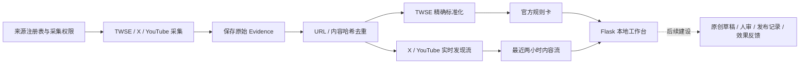

# Global X Finance 项目整体逻辑与数据源成本说明

> 核验日期：2026-08-16  
> 项目阶段：台湾实时来源雷达 MVP / 财经账号实时内容供给工作台基础层

## 一、结论摘要

这个项目目前本质上是一套**低成本、可追溯的财经数据与舆情雷达**，而不是已经完成的 AI 自动写稿或自动发帖系统。

当前运行链路几乎没有上游接口账单：

- TWSE 使用官方公开 OpenAPI，无 API Key。
- X 内容通过第三方 FxTwitter 公共接口读取，无 API Key，未购买官方 X API。
- YouTube 使用公开 Atom Feed，无 YouTube Data API Key。
- 数据库存放在本机 SQLite，展示层为本地 Flask 网页。
- 当前代码没有接入 OpenAI、Anthropic 或其他大模型服务。

但是，**“当前不收费”不等于“所有数据都永久免费、长期稳定且已获商业授权”**。最大的生产风险是 X：当前链路依赖第三方 FxTwitter，而 X 当前官方开发规范要求使用官方 API；官方 X API 已采用按量付费模式。因此，现有 X 方案更适合内部原型和小范围验证，不应被视为长期免费的生产级数据授权。

## 二、项目定位

项目的长期方向是为约 10–15 人的内容团队提供一套“财经账号实时内容供给工作台”，目标流程包括：

1. 发现官方市场信号和社交平台热点。
2. 保存可回查的原始 Evidence。
3. 聚合成选题候选和证据包。
4. 按不同账号定位生成原创草稿。
5. 由人工审核并手工发布。
6. 记录发布后 1H、6H、24H 表现，形成反馈闭环。

当前已经完成的是前半段的数据与治理基础；账号 Style Pack、自动草稿生成、人审工作流、发布记录和效果反馈仍属于后续阶段。

## 三、当前系统逻辑



### 1. 来源治理

项目不会因为一个网站或账号存在，就默认它可以被自动采集。

实时来源把六个问题分别保存：`identity_verified`、`endpoint_verified`、`monitoring_method_verified`、`terms_status`、`commercial_use_status` 与 `monitoring_status`。公开页面可访问不能替代条款或商业内部使用授权；`UNKNOWN` 不会被推断为允许。

其中 `monitoring_status` 只允许：

- `ACTIVE`：本地方法已配置并运行；不代表条款、商业使用或持续 SLA 已获确认。
- `MANUAL_ONLY`：只允许人工查看或按需处理。
- `NEEDS_VERIFICATION`：仍有核验未完成。
- `BLOCKED`：受到 robots、付费墙、授权或其他明确限制。

基础来源注册和实时来源注册是两个独立层次：

- `codex_mvp_inputs/verified_source_registry.csv`：17 个台湾官方、监管、媒体候选入口。
- `config/taiwan_realtime_sources.csv`：23 个台湾实时治理条目，其中 6 个的 `monitoring_status=ACTIVE`。

注册为 ACTIVE 只代表入口存在，不代表已经取得自动采集许可。真正的官方 TWSE 自动采集器只接受 `collection_status=API_VERIFIED` 的来源。

### 2. TWSE 官方数据链路

用户可以在本地网页点击同步，系统随后调用三个 TWSE 官方 OpenAPI 数据集：

1. 每日收盘行情－大盘统计资讯：`/v1/exchangeReport/MI_INDEX`
2. 集中市场外资及陆资投资类股持股比率表：`/v1/fund/MI_QFIIS_cat`
3. 上市个股日成交资讯：`/v1/exchangeReport/STOCK_DAY_ALL`

采集后，系统会：

1. 保存官方返回的原始 JSON。
2. 记录官方 Endpoint、查询时间、资料日期和内容哈希。
3. 按 URL 或 SHA-256 内容哈希去重。
4. 将字段精确映射到统一结构；缺失字段保留为 `UNKNOWN`。
5. 生成可回查原始 Evidence 的透明规则卡。

当前规则卡包括：

- 同一官方资料日期的成交量 Top 10。
- 同一官方资料日期的成交金额 Top 10。
- 同一官方资料日期的绝对日涨跌幅 Top 10。
- 官方外资及陆资持股比例展示。

这些卡片是日频、规则型研究信号，不是盘中实时行情、买卖建议或投资推荐。

### 3. X 实时发现链路

当前监控 5 个 X 账号：

- `mingchikuo`
- `dnystedt`
- `trendforce`
- `tculpan`
- `jimmy_yoasobi`

Windows 计划任务每 10 分钟唤醒一次调度器；每个 X 来源的目标检查间隔为 10 分钟。

实际读取不是官方 X API，而是复用本机 xHotTopic 项目中的 `FxTwitterTimelineSource`，请求：

```text
https://api.fxtwitter.com/2/profile/{handle}/statuses
```

系统只做公开内容的只读发现，不登录 X、不保存账号 Cookie、不自动点赞、不回复、不转发，也不发布内容。所有 X 内容默认标记为 `OPINION`，必须经过官方或合格来源交叉验证后，才能作为金融事实使用。

### 4. YouTube 实时发现链路

当前监控 1 个频道：臺灣證券交易所官方 YouTube 频道。

系统每 30 分钟读取公开 Atom Feed：

```text
https://www.youtube.com/feeds/videos.xml?channel_id=UCb_JzqaWz4Dw1OScrDpGxrg
```

当前只保存视频标题、链接、发布时间、频道和原始 Feed 元数据，不抓取视频正文或字幕。进入选题池的视频也默认按 `OPINION` 处理，不因为频道热度自动升级为金融事实。

### 5. Evidence、去重与健康状态

每条自动发现的数据都会保存：

- 原始 URL
- 原始文本或标题
- 原始 JSON / Feed 元数据
- 发布时间
- 发现时间
- 内容哈希
- 来源账号或频道
- `publisher_group`
- 采集运行记录

同一 URL 或同一内容哈希不会重复创建 Evidence。数据库触发器保护原始内容、原始 Payload、URL 和哈希，后续标准化或 AI 处理不能覆盖原始证据。

实时雷达还会保存：

- 每个来源的最近成功和失败时间。
- 连续失败次数。
- 请求耗时。
- 新增与重复数量。
- 下次到期时间。
- 首次回填标记。
- 新内容的发现延迟。

首次回填不会被纳入实时发现延迟，避免把历史内容误算成监控延迟。

### 6. 本地工作台

双击项目根目录的 `启动台湾Demo.bat` 后，系统会：

1. 创建或复用 `.venv`。
2. 安装运行依赖。
3. 初始化 SQLite 数据库和迁移。
4. 校验台湾／美国 Market Pack。
5. 导入来源注册表。
6. 导入实时雷达来源。
7. 标准化已有 TWSE Evidence。
8. 打开 `http://127.0.0.1:8765/`。

网页目前提供：

- 首页数据概览。
- 来源注册表。
- TWSE Evidence 列表与详情。
- 官方规则卡。
- 实时来源健康状态。
- 最近两小时发现流。
- X 广告政策证据与预检查页面。

## 四、数据源与成本判断

| 数据源 | 当前是否自动使用 | 当前直接接口费 | 是否需要密钥 | 主要限制与风险 |
|---|---:|---:|---:|---|
| TWSE OpenAPI | 点击同步 | 目前为 0 | 否 | 官方公开 GET；不是实时逐笔行情；永久免费和再利用权仍以官方条款为准 |
| FxTwitter / X | 是，5 个账号 | 目前为 0 | 否 | 第三方而非官方 X API；可用性、连续性和商业使用合规存在风险 |
| YouTube Atom Feed | 是，1 个频道 | 目前为 0 | 否 | 公开 Feed；不是完整 YouTube Data API；可变更或限流 |
| X 官方政策网页 | 手动快照 | 0 | 否 | 只用于合规证据，不提供财经热点 |
| 台湾监管／交易所网页 | 多数仅人工 | 0 或人工成本 | 否 | 尚未取得全部自动采集授权或技术核验 |
| 台湾财经媒体 | 当前不自动采集 | 不确定 | 通常否 | 条款、版权、转载和付费墙风险；DIGITIMES 等明确需订阅或授权 |
| 美国市场来源 | 未接入 | 未知 | 未知 | 美国 Market Pack 仍为空，等待经过核验的来源注册表 |
| AI 模型 | 未接入 | 0 | 否 | 当前没有自动写稿、模型推理或模型账单 |
| SQLite / Flask | 本地使用 | 软件费用为 0 | 否 | 需要本机持续开机和网络；迁移到云端后会产生服务器费用 |

### TWSE 是否免费

当前配置的 TWSE OpenAPI 可以无密钥访问，官方 Swagger 也未声明 API 安全认证方案；项目实际调用成功，因此当前没有直接接口费用。

不过，更准确的表述应该是：**当前公开、免密、未产生接口账单**，而不是承诺“永久、无限制、任何商业用途都免费”。正式商业使用仍应核对交易所最新开放数据条款、再利用规则和流量限制。

官方入口：<https://openapi.twse.com.tw/>

### X 是否免费

当前项目没有购买官方 X API，而是通过 FxTwitter 第三方公共接口读取公开账号时间线，所以目前没有 API 账单。

FxTwitter 官方项目文档将其描述为公共 API，并声明 API v2 的默认限流为每 IP 每分钟 1,000 次：

<https://github.com/FxEmbed/FxEmbed/blob/main/docs/src/content/docs/api/introduction.mdx>

但当前 X 官方开发规范要求开发者使用官方 API，官方 X API 已采用按量付费。2026-08-16 核验时，官方价格页面列出的普通 Post 读取价格为每个返回资源 0.005 美元：

- 官方开发规范：<https://docs.x.com/developer-guidelines>
- 官方 API 价格：<https://docs.x.com/x-api/getting-started/pricing>

因此，当前方案的准确判断是：

- 原型阶段：低成本、无需密钥、已经可以运行。
- 生产阶段：存在平台政策、授权、稳定性和第三方连续性风险。
- 若改用官方 X API：需要申请开发者账号、配置认证并承担按量费用。

### YouTube 是否免费

当前使用的是公开 Atom Feed，不是需要 API Key 的 YouTube Data API，因此目前没有 API 费用或配额账单。

如果未来需要搜索、频道详情、播放量、评论或更完整的元数据，通常需要改用 YouTube Data API。官方 Data API 使用每日配额管理；默认项目通常有 10,000 单位／日，但配额和服务条款可能调整：

- YouTube API 配额说明：<https://developers.google.com/youtube/v3/determine_quota_cost>
- YouTube API 服务条款：<https://developers.google.com/youtube/terms/api-services-terms-of-service>

## 五、当前真实运行状态

2026-08-16 核验时：

- Windows 计划任务 `Global X Finance - Taiwan Realtime Radar` 已安装。
- 最近一次观察到的任务执行结果为 `0`，表示调度脚本成功结束。
- 5 个 X 来源和 1 个 YouTube 来源最近一轮均成功。
- 数据库包含 1,786 条原始数据。
- 其中有 1,681 条 TWSE 标准化官方数据。
- 已生成 66 张官方规则卡。
- 实时雷达包含 105 条内容。
- 已保存 24 条实时雷达运行记录。

来源治理表共 23 条：

- `ACTIVE`：6 条
- `MANUAL_ONLY`：5 条
- `NEEDS_VERIFICATION`：10 条
- `BLOCKED`：2 条

这些数字只代表核验时点的本地状态，不构成 24/7 SLA。当前仍需连续观察至少 7 天，才能计算真实成功率和 P50／P95 发现延迟。

## 六、当前没有的能力

当前系统没有：

- 全网或全 X 热点覆盖。
- X 官方搜索、趋势或 Firehose 数据。
- 新闻媒体自动抓取。
- 美国市场真实数据源。
- AI 自动写稿。
- 自动发 X 或 YouTube。
- 自动点赞、关注、回复或私信。
- 代理 IP、账号池、Cookie 登录或限制规避。
- 投资建议或买卖信号。
- 真实的账号转化率和内容效果闭环。

## 七、主要风险

### 1. X 第三方接口风险

这是当前最重要的风险。FxTwitter 可能变更、限流或停止服务，同时它不是官方 X API。生产使用前必须决定：继续作为受控原型，还是迁移至官方按量付费 API。

### 2. 免费不等于授权

公开访问、无需登录和未产生账单，并不自动代表允许批量采集、长期存储、再分发或商业使用。媒体、平台和内容创作者的条款及版权仍需逐项确认。

### 3. 本地调度不是 24/7 服务

Windows 任务依赖本机开机、网络、Python 环境和本地 xHotTopic 路径。关机、休眠、网络故障或第三方接口异常都会中断采集。

### 4. 社交热度不等于金融事实

X、YouTube、论坛和 KOL 内容默认只是观点或选题线索。点赞、浏览量和传播速度只能说明注意力，不能证明事实正确，更不能直接形成投资建议。

### 5. 数据覆盖仍然有限

当前只有 5 个 X 账号和 1 个 YouTube 频道。台湾新闻媒体、MOPS、柜买、期交所、央行和美国市场尚未形成完整自动覆盖。

## 八、建议的下一步

优先级建议如下：

1. **先决定 X 生产数据方案**：接受并治理 FxTwitter 原型风险，或改用官方 X API并建立费用上限。
2. **连续观察 7 天**：记录每轮成功率、失败原因、P50／P95 发现延迟和新增内容量。
3. **补充官方事实源**：在取得技术及使用授权后，逐步接入 MOPS、柜买、期交所和央行。
4. **再接媒体源**：逐个审查条款、版权、付费墙和转载关系，不直接做通用网页抓取。
5. **最后建设内容生产闭环**：定义 `TopicCandidate`、`EvidenceBundle`、`ContentDraft` 和 `PerformanceSnapshot`，再加入原创草稿、人审和 1H／6H／24H 效果反馈。

## 九、一句话判断

**TWSE 官方数据部分相对稳、当前免密且可追溯；YouTube 当前成本低；X 当前不花接口费但依赖第三方，是整个项目最主要的稳定性与商业合规隐患。**
